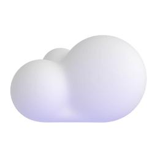
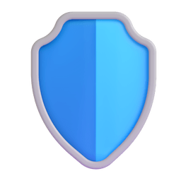

  <!-- Três objetos 3D fofos, que se movem de verdade e NÃO possuem fundo (transparentes) -->
  

    
    &nbsp;&nbsp;&nbsp;&nbsp;&nbsp;&nbsp;&nbsp;&nbsp;&nbsp;&nbsp;&nbsp;&nbsp;
    
    &nbsp;&nbsp;&nbsp;&nbsp;&nbsp;&nbsp;&nbsp;&nbsp;&nbsp;&nbsp;&nbsp;&nbsp;
    
  

  <h1>Olá, eu sou o Wallison Araujo! 👋</h1>

  <!-- Texto dinâmico que digita sozinho -->
  

  
✨ <i>Transformando ideias em código e mantendo a rede rodando de forma segura!</i> ✨

---

### 🚀 Sobre Mim
Sou um profissional com perfil híbrido, atuando no **desenvolvimento de sistemas** modernos (Web/Mobile) e na administração de **infraestrutura de redes, servidores e cibersegurança** na *ABC Associação Brasil Central*. 

- 💼 **Administrador de TI / Redes** na ABC Associação Brasil Central.
- 📱 **Desenvolvimento Web & Mobile:** Criação de interfaces fluidas e seguras.
- 🛡️ **Segurança e Redes:** Implementação de políticas Zero Trust, gerenciamento de VLANs e Firewalls redundantes.
- ⚙️ **Organização e Produtividade:** Focado em processos otimizados com metodologia GTD e documentação contínua.

---

### 🛡️ Recursos em Destaque (Open Source)

Se você trabalha com infraestrutura, redes ou segurança corporativa, confira os meus recursos e cheat sheets públicos:

*   **[awesome-secure-infrastructure](https://github.com/WallisonWS/awesome-secure-infrastructure)**: Guia de arquitetura Zero Trust, Cheat Sheets de comandos CLI para **FortiGate 80F** e **Switches Aruba**, além de scripts Python/PowerShell para automação de backups de equipamentos.

---

### 🛠️ Tecnologias e Ferramentas

  **💻 Software Development**
  
  
  
  
  
  
  

   

  **🔒 Redes & Cibersegurança**
  
  
  
  
  
  
  

   

  **⚙️ Infraestrutura & Virtualização**
  
  
  
  
  

   

  **🎙️ Telecom, CFTV & Monitoramento**
  
  
  
  

   

  **🎨 Design & Audiovisual**
  
  
  
  

   

  **📊 Gestão & Produtividade**
  
  
  
  

---

### 🏛️ Sistemas de Gestão & Apoio (Corporativo / Escolar)
Administração, suporte técnico e manutenção preventiva dos sistemas integrados da instituição:

*   **CPB / E-CLASS** – Gestão educacional, portal de alunos/pais e docentes.
*   **SAD** – Sistema de Apoio ao Docente.
*   **SSE** – Sistema de Secretaria Escolar.
*   **AASI & CFE** – Sistemas de contabilidade e finanças escolar.
*   **APS** – Sistema de gestão de folha de pagamento.
*   **Urania & Sino** – Geração de grade de aulas e controle automatizado de intervalos de aulas.

---

### 📊 Estatísticas & Atividade (Cobrinha)

  
  &nbsp;&nbsp;
  

 

  <!-- Animação da cobrinha comendo os quadradinhos gerada automaticamente a cada 12 horas -->
  <picture>
    <source media="(prefers-color-scheme: dark)" srcset="https://raw.githubusercontent.com/WallisonWS/WallisonWS/output/github-contribution-grid-snake-dark.svg">
    <source media="(prefers-color-scheme: light)" srcset="https://raw.githubusercontent.com/WallisonWS/WallisonWS/output/github-contribution-grid-snake.svg">
    
  </picture>

---

### 🤝 Conecte-se Comigo

  
  &nbsp;&nbsp;&nbsp;&nbsp;
  

